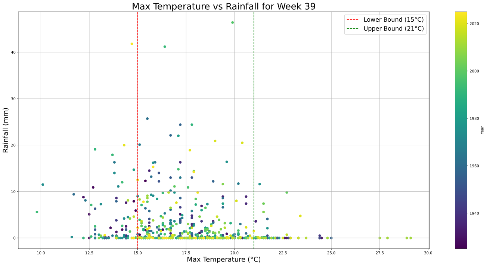

# What's the best exam week

Investigating which time of year has the best weather for exams.

See [tristanhodgson.com/blog#exam-time](https://tristanhodgson.com/blog#exam-time) for explanation.

## Graphs

## Data

Data is from the Radcliffe Observatory site in Oxford, we cut it off data before 1925 due to changes in how data was measured. To use this code please download the following dataset and name the CSV file `data.csv` in the same directory as the code.

https://www.geog.ox.ac.uk/research/climate/rms/daily-data.html